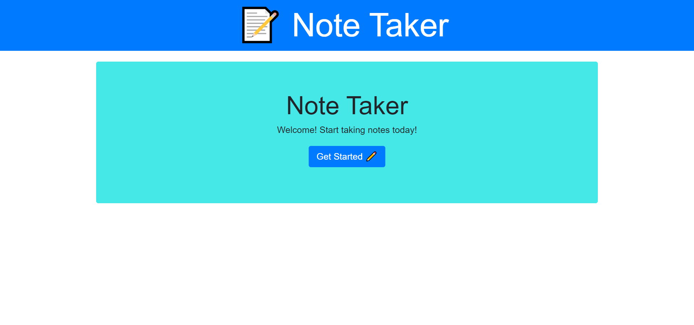

# [My Note Taker](https://my-note-taker-001.herokuapp.com/) 

[](https://choosealicense.com/licenses/mit/)

  ## Table of Contents

  - [Description](#description)
  - [Installation](#installation)
  - [Usage](#usage)
  - [License](#license)
  - [Contributing](#contributing)

  ## Description
  
  The motivation for this project was to build a Node.js command-line application that will take any type of note you cretae and saves it in the herokuapp servers. The reason for this is to help create a server page that you can save your own personal notes anytime and anywhere. It solve a better and faster way to to save and get your personal notes. For this project I learn that to better improve myself I need to continuously learn all the new tips and knowledge that I can  implement in every project that I can get my hands on.

  ## Installation

  Steps to install application:
  1. Clone repository.
  2. In the directory with server.js run npm install
  3. In the command line run node index.js
  4. Open a local host web browser with the correct port shown

```
npm install
```
  ## Usage
  
  After you run 'node index.js' it will show you the local host port you will need to use to put on the web browser. you can also just go directly to ther hosted server in https://my-note-taker-001.herokuapp.com/. In the page you will click the get started button to start making some notes, after that it will change to another page with 2 left side buttons. One button will show you all the past saved notes and the other one will give the input for creating new notes.

  ### Screenshots

1. Working app

[My Note Taker App](https://my-note-taker-001.herokuapp.com/)

2. Example of My Note maker




  ## Contributing

  Have you spotted a typo, would you like to fix a link, or is there something you’d like to suggest? Browse the source repository of this article and open a pull request. I will do my best to review your proposal in due time.

  ## License

  [](https://choosealicense.com/licenses/mit/)


  
  